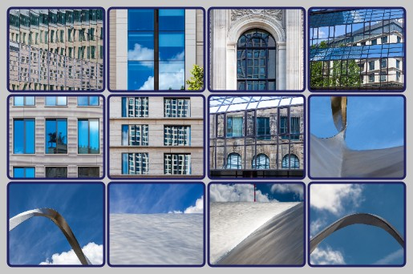
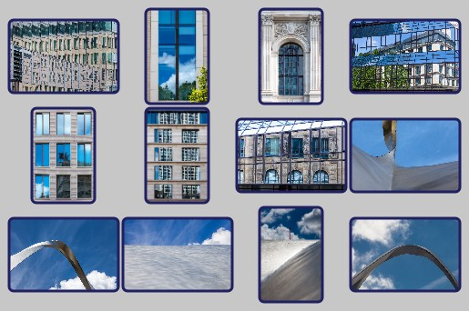
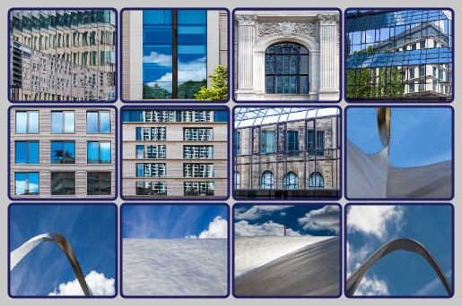
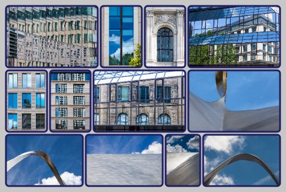
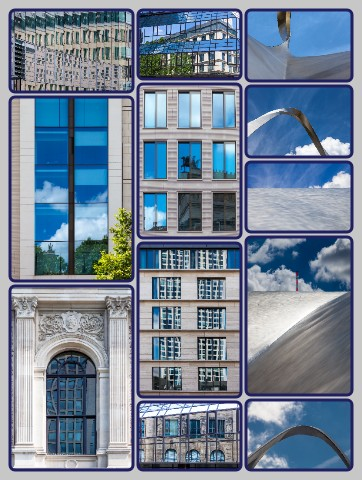

[README.md](https://github.com/user-attachments/files/30433799/README.md)
# Poster Generator

**JavaScript Anwendung zur Zusammenstellung von mehreren Bildern zu einem Poster**

v3.1 2026-07-30 (c) RannerDesign, MIT License

## Zielsetzung

Aufbau einer Bilddatei ("Poster") im jpeg-Format, die aus mehreren Einzelbildern zusammengesetzt ist. Die Einzelbilder können dabei beliebige Seitenverhältnisse besitzen. Die Kombination erfolgt entweder als Raster mit vorgegebener Anzahl Zeilen und Spalten oder in Form horizontaler oder vertikaler Streifen, bei denen die Einzelbilder auf gleiche Höhe bzw. Breite skaliert werden.

## Voraussetzungen und Installation

Die Anwendung wird als HTML-Dokument auf einem Webserver bereitgestellt. Eine Installation ist nicht erforderlich. Voraussetzung zur Nutzung ist ein Web-Browser mit JavaScript-Unterstützung. Die Anwendung ist getestet mit Google Chrome 125, FireFox 126 und Safari IOS 17.5, sollte aber auf den meisten gängigen Browsern lauffähig sein.

Das Programm steht darüber hinaus als Open Source zur Verfügung unter https://github.com/RannerDesign/poster/

## Verwendete Softwarekomponenten

Folgende Ideen und Programme anderer Autoren wurden unter Berücksichtigung der jeweiligen Lizenzbedingungen für diese Anwendung eingesetzt:

- **dom-to-image-more** (c) Marc Brooks, Anatolii Saienko, Paul Bakaus, MIT License, 
  https://github.com/IDisposable/dom-to-image-more
- **heic-to** (c) Hopper Gee, LGPL-3.0 License, https://github.com/hoppergee/heic-to
- **exif-reader** (c) Mattias Wallander, MPL-2.0 License, https://github.com/mattiasw/ExifReader
- Verbesserter **Algorithmus** basierend auf einem Dynamic Programming Ansatz von fedja, 
  https://mathoverflow.net/questions/473701/

Den Autoren wird für ihre Ideen und die Entwicklung und Bereitstellung der Programme ein besonderer Dank ausgesprochen.

## Benutzeroberfläche

### Poster Generator

#### Hilfe

Die Schaltfläche ***Hilfe*** zeigt diese Programmbeschreibung an.

#### Sprache

Sprachauswahl (deutsch oder englisch)

### 1. Bilder laden

#### 1.1. Bildauswahl per Drag-and-Drop oder Dateiauswahl

Für die Auswahl von Bildern, die verwendet werden sollen, stehen 2 Möglichkeiten zur Verfügung:

1. durch Ziehen von einem oder mehreren Bildern aus dem Explorer in die gestrichelt umrandete Fläche
2. durch Klicken in diese Flächen und Nutzung des danach geöffneten Dateiauswahldialogs

Nach der Bildauswahl werden alle ausgewählten Bilder sofort in das Programm geladen. Während des Ladevorgangs erscheint neben der Schaltfläche ein roter Punkt und die Anzeige der noch zu ladenden Bilder. Nach Abschluss des Ladevorgangs wird am unteren Ende der Webseite die Liste der geladenen Bilder angezeigt, jeweils mit kleinem Bild und den wichtigsten Metadaten. In dieser Liste können einzelne Bilder gelöscht (Klick auf den Papierkorb daneben) oder verschoben werden, um die Reihenfolge zu ändern. Das Verschieben erfolgt mittels Drag-and-Drop, in dem ein Bild angeklickt und bei gedrückter Maustaste auf ein anderes Bild gezogen wird.

Die Funktion ***Bilder laden*** kann beliebig oft nacheinander ausgeführt werden, um Bilder in Gruppen zu laden, bzw. dazwischen auch einzelne Bilder wieder zu löschen oder die Reihenfolge verändern. Auch wenn schon die Funktion ***Poster erstellen*** ausgeführt wurde, können weitere Bilder geladen oder vorhandene wieder entfernt werden.

Mit Version 3 dieses Programms wird auch das Dateiformat HEIF unterstützt. Da dieses Format im Browser nicht direkt unterstützt wird, muss eine Konvertierung in JPG erfolgen, die beim Lader der Bilder einen merklichen Zeitbedarf verursacht.

#### 1.2. Bilder löschen

Mittels Schaltfläche ***Bilder löschen*** werden **alle** geladenen Bilder entfernt. Einzelne Bilder können in der Liste am Ende der Seite gelöscht werden. Ein evtl. geladenes Hintergrundbild bleibt erhalten.

### 2. Poster-Typ festlegen

Die Anwendung unterstützt 3 verschiedene Arten ("Poster-Typ") im Aufbau des Posters. 

Diese sind nachfolgend beschrieben, wobei bereits die Besonderheiten einiger Parameter aus Schritt 5 erläutert werden.

#### 2.1. Raster

Dieser Poster-Typ ist vor allem für Bildmaterial geeignet, das aus einheitlichen Seitenverhältnissen der Bilder besteht. Die Struktur des Posters entspricht einer Tabelle mit gegebener Anzahl Zeilen und Spalten.

Als Parameter werden zunächst **Anzahl Spalten** und **Anzahl Zeilen** benötigt. Sofern eine Zeilenzahl nicht angegeben wird, werden so viele Zeilen generiert, um alle geladenen Bilder anzuzeigen. Sofern Anzahl Zeilen und Spalten angegeben werden, wird das Poster mit diesen Zahlen generiert. Wenn die Anzahl geladener Bilder nicht ausreicht, entstehen leere Flächen im Poster. Wenn die Anzahl geladener Bilder größer ist als (Anzahl Zeilen * Anzahl Spalten) werden die übrigen Bilder nicht ins Poster übernommen.

Alle einzelnen Bilder werden in einem gleich dimensionierten Rechteck dargestellt. Dieses wird durch **Einzelbild Breite**, **Einzelbild Höhe** und **Seitenverhältnis** (Breite : Höhe) bestimmt. Werden Breite und Höhe angegeben, sind diese Angaben maßgeblich und eine zusätzliche Eingabe bei Seitenverhältnis ignoriert.

Wird nur eine Angabe, d.h. Breite oder Höhe, gemacht, errechnet sich die fehlende Größe über das **Seitenverhältnis**.

Für das Seitenverhältnis sind verschiedene Eingaben möglich:

- Dezimalzahl (mit Punkt oder Komma als Dezimaltrennzeichen)
- Eine Angabe Breite : Höhe (z.B. "4:3")
- "**E**": es wird das Seitenverhältnis des ersten Bildes der geladenen Liste verwendet
- "**L**": es wird das Seitenverhältnis des letzten Bildes der geladenen Liste verwendet
- "**D**": es wird der arithmetische Durchschnittswert der Seitenverhältnisse aller geladenen Bilder verwendet
- "**M**": es wird das Seitenverhältnis verwendet, das bei den meisten geladenen Bildern vorkommt

Wenn das Seitenverhältnis leer gelassen wird, wird "D" angenommen.

Da beim Poster-Typ Raster als Platz für alle Bilder das gleiche Rechteck verwendet wird, muss für Bilder, deren Seitenverhältnis nicht diesem Rechteck entsprechen, entschieden werden, wie das Einzelbild in das Rechteck eingepasst wird. Hierfür stehen 3 Optionen zur Verfügung:

**Originalverhältnis**

Hier wird das gesamte Bild dargestellt unter Erhalt seines Seitenverhältnisses, dies hat zur Folge, dass das Rechteck u.U. nicht vollständig ausgefüllt wird und oben und unten bzw. rechts und links leere Flächen mit Hintergrundfarbe entstehen

**Ausfüllen**

Hier wird das gesamte Bild dargestellt, wobei das Seitenverhältnis nicht erhalten bleibt, sondern Breite und Höhe des Einzelbildes auf die Größe des Rechtecks skaliert wird. Dies hat u.U. eine erhebliche Verzerrung zur Folge

**Ausschnitt**

Hier wird ein Teil des Einzelbildes dargestellt unter Erhalt des Seitenverhältnisses. Dadurch wird das gesamte Rechteck ausgefüllt und gleichzeitig eine Verzerrung vermieden. Der Zuschnitt erfolgt mittenzentriert, so dass rechts und links bzw. oben und unten etwas vom Originalbild fehlen kann.

#### 2.2. Streifen horizontal

Dieser Poster-Typ ist gut geeignet für Bildmaterial mit sehr unterschiedlichen Seitenverhältnissen. Die Bilder werden in horizontalen Streifen angeordnet, somit haben alle Bilder in einem Streifen die gleiche Höhe.

Bilder im Hochformat sind damit etwas "benachteiligt", da sie weniger Fläche erhalten als Bilder im Querformat. Die verschiedenen Streifen können unterschiedlich hoch sein, da sie immer so skaliert werden, dass die Posterbreite vollständig ausgenutzt wird.

Bei diesem Poster-Typ ist nur die **Gesamtbreite** des Posters exakt vorgebbar. Die **Höhe** kann nur ungefähr gewünscht werden, da für die Skalierung der Streifen auf Posterbreite und der damit einhergehenden Höhenveränderung Freiraum zur Anpassung notwendig ist.

Es kann allerdings auch auf die Angabe der **Höhe** verzichtet werden. Dann muss dafür entweder die  **Anzahl** horizontaler Streifen vorgegeben werden oder die **Bilder pro Zeile**. Bei letzterer Angabe wird entweder eine Zahlenreihe getrennt durch Kommata oder Leerzeichen erwartet oder eine Angabe wie n * m bzw. n x m, wobei n die Anzahl Zeilen und m die Anzahl Bilder pro Zeile repräsentiert.

Die Höhe ergibt sich dann durch die Berechnung.

#### 2.3. Streifen vertikal

Dieser Poster-Typ ist ebenfalls gut geeignet für Bildmaterial mit sehr unterschiedlichen Seitenverhältnissen. Die Bilder werden in vertikalen Streifen angeordnet, somit haben alle Bilder in einem Streifen die gleiche Breite.

Bilder im Querformat sind damit etwas "benachteiligt", da sie weniger Fläche erhalten als Bilder im Hochformat. Die verschiedenen Streifen können unterschiedlich breit sein, da sie immer so skaliert werden, dass die Posterhöhe vollständig ausgenutzt wird.

Bei diesem Poster-Typ ist nur die **Gesamthöhe** des Posters exakt vorgebbar. Die **Breite** kann nur ungefähr gewünscht werden, da für die Skalierung der Streifen auf Posterhöhe und der damit einhergehenden Breitenveränderung Freiraum zur Anpassung notwendig ist.

Es kann allerdings auch auf die Angabe der **Breite** verzichtet werden. Dann muss dafür entweder die  **Anzahl** vertikaler Streifen vorgegeben werden oder die **Bilder pro Spalte**. Bei letzterer Angabe wird entweder eine Zahlenreihe getrennt durch Kommata oder Leerzeichen erwartet oder eine Angabe wie n * m bzw. n x m, wobei n die Anzahl Spalten und m die Anzahl Bilder pro Spalte repräsentiert.

Die Breite ergibt sich dann durch die Berechnung.

Welcher Poster-Typ der beste für eine gegebene Menge an Bildern ist, ist Geschmackssache und kann oft nur durch Probieren herausgefunden werden. Manchmal hilft auch eine Verschiebung in der Bildreihenfolge, um bessere Wirkung zu erzielen.

### 3. Ausgabeformat festlegen

Die Erzeugung der jpeg-Datei für das Poster kann mit dieser Anwendung technisch auf 2 verschiedenen Wegen erfolgen. Dies schien anfänglich erforderlich, da verschiedene Browserversionen unterschiedliches Verhalten zeigten und bei großer Anzahl Bilder unterschiedliche Performanceeinbußen resultierten. Dieses Verhalten ist mittlerweile nicht mehr der Fall, die beiden Ausgabeformate führen in den meisten Fällen zum nahezu exakt gleichen Ergebnis.

Beide Möglichkeiten werden dennoch parallel beibehalten, da es im Detail doch noch ein paar Unterschiede gibt, die nachfolgend beschrieben sind.

#### 3.1. Canvas

Dieses Ausgabeformat ist der Standardfall. Es erfüllt alle Grundfunktionen der Anwendung ohne Einschränkung.

#### 3.2. HTML

Dieses Ausgabeformat bietet über die Grundfunktionen hinaus noch die Funktion Vergrößerung sowie die Möglichkeit, die ganze Datei im .html-Format zu speichern (s. 6. Punkt)

### 4. Poster Parameter

In diesem Abschnitt sind alle Parameter zusammen gestellt, mit der die Erzeugung des Posters gestaltet und beeinflusst werden kann. Einige Parameter wurden bereits im Abschnitt 3 beschrieben, da sie spezifisch für Poster-Typ sind.

Folgende Parameter sind für alle Varianten gültig:

**Posterränder**: Randabstand der Bilder in Pixel
Bei Eingabe von einer Zahl ist dies der Abstand oben, rechts, unten und links.
Bei Eingabe von 2 durch Komma getrennte Zahlen bestimmt die erste den Randabstand oben und unten und die zweite rechts und links.
Bei Eingabe von 3 durch Kommata getrennte Zahlen bestimmt die erste oben, die zweite rechts und links und die dritte unten.
Bei Eingabe von 4 durch Kommata getrennten Zahlen bestimmen diese die Randabstände in der Reihenfolge oben, rechts, unten, links.

**Bildzwischenraum**: Abstand zwischen den Einzelbildern in Pixel
Bei Eingabe einer Zahl gilt dies sowohl für horizontale wie vertikale Abstände, bei 2 durch Komma getrennten Zahlen bestimmt die erste den horizontalen und die zweite den vertikalen Abstand.

**Hintergrundfarbe**: Farbwahlmöglichkeit als RGB, HSL oder hex definiert die Hintergrundfarbe des gesamten Posters.

**Hintergrundbild**: Schalter, der ein Hintergrundbild aktiviert und Parametereingabe weiter unten ermöglichst.

**Bildtitel**: Schalter, der die Einblendung von Bildtiteln ermöglichst mit Parametereingabe weiter unten.

Für das Einzelbild gibt es noch folgende Einstellmöglichkeiten:

**Rahmenstärke**: Dicke des Rahmens um das Einzelbild in Pixel

**Rahmenmuster / Rahmenstil**: Hier gibt es Unterschiede abhängig vom Ausgabeformat.

Im Falle **Canvas** kann hier nur ein Linienmuster (z.B. für gestrichelte Linien) eingetragen werden. Dieses besteht aus einer oder mehreren durch Leerzeichen oder Kommata getrennten Zahlen. Die einzelnen Zahlen stellen Pixelangaben dar. Ist die Anzahl der Zahlen ungerade, wird die Zahlenreihe nochmals an sich angehängt, so dass nun eine gerade Anzahl vorliegt. Die Zahlen werden dann abwechselnd als Längenangaben für Strich und Zwischenraum der Linie interpretiert.

Im Falle **HTML** kann der Rahmenstil aus einer Auswahlliste selektiert werden. Die angebotenen Optionen werden typischerweise zur Gestaltung von Webseiten verwendet. Inwieweit insbesondere die spezielleren Optionen sich zur Postergestaltung eignen, kann nur durch Ausprobieren festgestellt werden.

**Rahmenfarbe**: Farbwahlmöglichkeit als RGB, HSL oder hex definiert die Farbe des Rahmens um das Einzelbild.

**Eckenrundung**: Rundungsradius aller Ecken in Pixel

**Postername**: Hier kann ein Name für das Poster-Fenster angegeben werden. Falls leer, wird als Name `posterX` verwendet, wobei X=1, 2 oder 3 den drei Poster-Typen entspricht. Bei erneuter Poster-Erzeugung wird das Poster-Fenster jeweils wiederverwendet und überschrieben. Will man mehrere Posterentwürfe ohne jpeg-Ausgabe vergleichen kann man dies erreichen, indem man jeweils vor der Erzeugung einen neuen Posternamen vergibt. Dann wird für jeden Posternamen ein neues Fenster erstellt.

**Ausgabedateityp**: Hier kann für das Ausgabeformats des Posters zwischen jgp und png gewählt werden. Es stehen nicht auf allen Betriebssystemplattformen beide Dateitypen zur Verfügung. So ist z.B. auf iPhone und iPad nur png als Dateityp unterstützt. Der Wert dieses Parameters wird daher in Abhängigkeit des Betriebssystems vorbelegt.

**Ausgabequalität**: Dezimalzahl (mit Punkt oder Komma als Dezimaltrennzeichen) zwischen 0 und 1, die die jpeg-Qualität und damit indirekt die Dateigröße beeinflusst. Voreinstellung ist 0,90. Die Eingabe einer Prozentzahl (z.B. 90%) ist ebenfalls möglich.

#### Hintergrundbild

Wenn der Schalter für Hintergrundbild aktiviert wurde, besteht die Eingabemöglichkeit für eine Bilddatei, auch in diesem Fall wieder alternativ per Drag-and-Drop oder über den Dateiauswahldialog.

Nach dem Laden eines Bildes wird dieses in kleinem Format mit den wesentlichen Daten angezeigt. Danach können noch folgende Parameter ausgewählt werden:

**Bildanpassung**: Sofern das geladene Hintergrundbild nicht exakt der Größe des auszugebenden Posters entspricht, erfolgt Anpassung.

Im Falle "<u>keine Anpassung</u>" wird das Hintergrundbild ohne Größenänderung verwendet. Ist es in Breite und Höhe größer oder gleich dem Poster, erfolgt lediglich Positionierung. Andernfalls wird das Bild kachelartig wiederholt.

Im Falle "<u>Ausfüllen</u>" wird das Hintergrundbild in Breite und Höhe auf die Maße des Posters gebracht. Dies kann zu ggf. erheblichen Verzerrungen führen.

Im Falle "<u>Proportional</u>" wird das Hintergrundbild unter Erhaltung des Seitenverhältnisses so skaliert, dass Breite und Höhe des Posters abgedeckt werden,  ggf. erfolgt noch Positionierung.

**Positionierung**: Ankerpunkt, gekennzeichnet durch 2 Buchstaben, der erste für die horizontale Position (L: links, M: mittig, R: rechts), der zweite für die vertikale (O: oben, M: mittig, U: unten). Im Falle der Positionierung wird beispielsweise bei "RO" der rechte obere Eckpunkt des Hintergrundbildes auf den rechten oberen Eckpunkt des Posters gelegt.

**Opazität**: regelt, wie stark die Hintergrundfarbe des Posters noch durchscheint. Bei 0 ist das Hintergrundbild unsichtbar und nur die Hintergrundfarbe erscheint, bei 1 ist nur das Hintergrundbild sichtbar.

Ein Löschen des Hintergrundbildes ist nicht vorgesehen, da die Funktion Hintergrundbild über den entsprechenden Schalter deaktiviert werden kann.

#### Bildtitel

Zum Einfügen von Bildtiteln für jedes Einzelbild auf dem Poster bestehen folgende Möglichkeiten

- Bildtitel aus den Metadaten der Bilddateien
- Manuell eingegeben Bildtitel
- Verwendung des Dateinamens als Bildtitel

Beim Laden von Bilddateien werden die Metadaten dahingehend ausgewertet, ob ein Bildtitel vorhanden ist. Dazu werden die IPTC-Felder 'Object Name', 'Headline', 'Caption' und 'Caption/Abstract' ausgewertet sowie das EXIF-Feld 'ImageDescription'. Wenn ein Bildtitel gefunden wurde, wird dieser in der Darteiliste am Ende der Seite angezeigt. Das Feld in dieser Liste ist editierbar, so dass Bildtitel geändert und auch neu eingetragen werden können (manuelle Bildtitel). Falls Bildtitel fehlen, kann auch wahlweise der Dateiname verwendet werden.

Wenn der Schalter für Bildtitel aktiviert wurde, können folgende Parameter eingestellt werden:

**Schriftart**: Auswahl der Font Family zur Anzeige von Bildtitels. Hier stehen zunächst eine kleine Anzahl von Standardschriftarten zur Verfügung, die stets verfügbar sein sollten.

Sofern Browser und Betriebssystem dies unterstützen, erscheint rechts daneben eine Schaltfläche, die bei Programmstart "Standard Fonts" anzeigt. Durch Klicken auf diese Schaltfläche werden alle auf dem Gerät installierten Fonts angezeigt. Dafür muss u.U. die Abfrage einer Browserberechtigung genehmigt werden. Danach stehen alle Fonts zur Verfügung, was auch auf der Schaltfläche angezeigt wird. Durch erneutes Klicken auf die Schaltfläche kann zu den Standardschriftarten zurückgekehrt werden.

**Schriftgröße**: Schriftgröße in Pixel.

**Schriftfarbe**: Farbauswahl für die Schrift

**Schriftkantenfarbe**: Farbauswahl für die Umrahmung der Schrift (Ausgabeformat Canvas) bzw. Schatteneffekte (Ausgabeformat HTML) zur Verbesserung der Lesbarkeit.

**Schriftkantenstärke**: Linienstärke (Ausgabeformat Canvas) bzw. Schattenoffset (Ausgabeformat HTML) in Pixel.

**Dateiname als Bildtitel**: Wenn aktiviert, wird bei fehlendem Bildtitel der Dateiname als Bildtitel verwendet.

**Bildanker**: Referenzpunkt am Bild für die Positionierung des Bildtitels. Angabe durch 2 Buchstaben für horizontale (L: links, M: mittig, R: rechts) und vertikale (O: oben, M: mittig, U: unten) Lage.

**Textanker**: Referenzpunkt am Text für die Positionierung des Bildtitels. Angabe durch 2 Buchstaben für horizontale (L: links, M: mittig, R: rechts) und vertikale (O: oben, M: mittig, U: unten) Lage.

**Abstände**: Position des Textankerpunktes in Bezug auf den Bildankerpunkt als 2 Zahlen für horizontale und vertikale Distanz in Pixel, getrennt durch Leerzeichen oder Komma.
*Beispiel*: Bildanker = "MU", Textanker = "MO", Abstände = "5, 20" bewirkt, dass der Text so positioniert wird, dass der mittlere obere Punkt des Textfeldes 5 Pixel rechts und 20 Pixel tiefer liegt als der untere mittlere Punkt des Bildes.

**Textwinkel**: Winkel der Textausrichtung in Grad.

### 5. Poster erstellen

#### 5.1. Poster anzeigen

Mit der Schaltfläche ***Poster anzeigen*** erfolgt die Erstellung des Posters. Dies erfolgt in einem eigenen Fester, das neu entsteht oder - bei Folgeaufrufen - wiederverwendet wird. Da das Fenster wiederverwendet wird, sollte man es schließen, wenn sich die Außenmaße des Posters ändern. Ansonsten muss man es manuell auf die richtige Größe bringen.

Die Anzeige im Fenster dient primär zur Prüfung des Ergebnisses, so dass ggf. Programmoptionen, Parameter oder Bildreihenfolgen geändert werden können. Zudem ist der angezeigte Zustand die Basis für die nachfolgende Funktion ***Poster speichern***.

Im Ausgabeformat **HTML** besitzt dieses Fenster darüber hinaus noch folgende Zusatzfunktionen:

**Vergrößerung**: Durch Klicken auf ein Einzelbild erscheint dieses vergrößert, zudem kann man durch die Bilderreihe navigieren mit den Tasten Pfeil-rechts, Pfeil-links, Bild-hoch, Bild-runter, Pos1 und End oder durch Klick auf die entsprechenden Schaltflächen. Man hat somit gleich eine kleine Bildergalerie.

**Speichern als HTML**: Mit der Tastenkombination **Strg+s** kann das Poster mit der zuvor beschriebenen Funktionalität als HTML-Datei gespeichert werden. Die ausgegebene .html-Datei enthält alle verwendeten Bilder in voller Auflösung, dadurch ist der Speicherplatzbedarf dieser Datei ein Vielfaches der korrespondierenden jpeg-Datei. Die .html-Datei kann lokal verwendet und im Browser angezeigt oder aber auch auf einem Webspace im Internet bereitgestellt werden. Diese Funktion sollte nicht mit der nachfolgend beschriebenen Funktion Poster speichern verwechselt werden.

#### 5.2. Poster speichern

Mit der Schaltfläche ***Poster speichern*** kann das Poster als jpeg-Datei gespeichert werden. Als Dateiname wird der Postername vorgeschlagen, kann jedoch durch Eingabe überschrieben werden.

Diese Schaltfläche steht nur zur Verfügung, wenn ein Poster generiert und angezeigt wurde. Ausgegeben wird stets der letzte mittels ***Poster anzeigen*** dargestellte Zustand auch wenn das Poster-Fenster zwischenzeitlich geschlossen wurde. Parameteränderungen danach werden immer erst wirksam, wenn die Funktion ***Poster anzeigen*** gewählt wurde.

