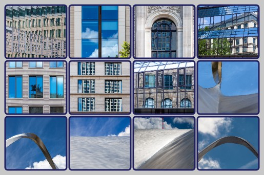
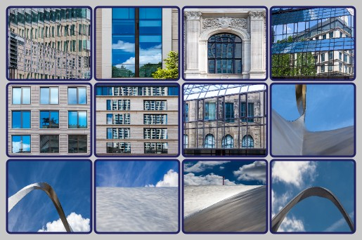

# Poster Generator

**JavaScript Application for assembling multiple images into one poster**

v2.1 2024-06-03 (c) RannerDesign, MIT License

## Objective

Construction of an image file ("poster") in jpeg format, which is composed of several individual images. The individual images may have any aspect ratio. The combination is either done as a grid with a specified number of rows and columns or in the form of horizontal or vertical stripes, where the individual images are scaled to the same height or width.

## Requirements and Installation

The application may be used locally or be installed on a web server. Only the html-, js- and some image files need to be copied to the target directory. More installation is not required. A web browser with JavaScript support is required to use the application. The application has been tested with Google Chrome 125, FireFox 126 and Safari IOS 17.5, but should run on most common browsers.

Two language versions of the application are provided: English (poster_en.html) and German (poster_de.html) depending on the used html file.

## Acknowledgements

The following ideas and programs from other authors have been used for this application in accordance with the respective license conditions:

- **dom-to-image** (c) 2015 Anatolii Saienko, MIT License, https://github.com/tsayen/dom-to-image

- Improved **Algorithm** based on a Dynamic Programming approach by fedja, 
  https://mathoverflow.net/questions/473701/

## User Interface

### 1. Select Images

#### 1.1. Image selection via drag-and-drop or file selection

There are two options for selecting images to be used:

1. by dragging one or more images from the Explorer into the dashed outlined area
2. by clicking in this area and using the file selection dialog that opens

After image selection, the number of images is displayed to the right of the dashed outlined area. In addition, the list of selected file names is displayed at the bottom of the web page.

#### 1.2. Delete Selection

If images have been selected by mistake, the entire selection can be removed using the ***Delete selection*** button. Individual images cannot be deleted this way, but only after loading images (see step 2)

#### 1.3. Help

The ***Help*** button displays this program description.

### 2. Load Images

#### 2.1. Load Images

Using the ***Load Images*** button, all selected images are loaded into the program. During the loading process, a red dot appears next to the button and the images still to be loaded are displayed. Once the loading process is complete, the selected images in step 1 and the list at the bottom of the web page are no longer displayed.

The list of loaded images is now displayed at the bottom of the website, each with a small image and the most important metadata. In this list, individual images can be deleted (click on the wastebasket next to it) or moved to change the order. Moving is done using drag-and-drop, where you click on an image and drag it over another image while holding down the mouse button.

The sequence <u>1. Select images</u> and <u>2. Load images</u> can be carried out as often as you like in order to load images in groups, or to delete individual images or change the order. Even if function <u>6. Create poster</u> has already been carried out, additional images can be loaded or existing ones removed.

#### 2.2. Remove Images

The ***Remove Images*** button removes **all** loaded images. Individual images can be deleted from the list at the bottom of the page.

### 3. Select Poster Type

The application supports 3 different types ("poster type") in the structure of the poster.

These are described below, whereby the special features of some parameters from step 5 are already explained.

#### 3.1. Grid

This type of poster is particularly suitable for images that consist of uniform aspect ratios. The structure of the poster corresponds to a table with a given number of rows and columns.

The first parameters required are the **number of columns** and the **number of rows**. If the number of rows is not specified, enough rows are generated to display all the loaded images. If the number of rows and columns are specified, the poster is generated with these numbers. If the number of loaded images is not sufficient, empty spaces appear in the poster. If the number of loaded images is greater than (number of rows * number of columns), the remaining images are not included in the poster.

All individual images are displayed in a rectangle of the same size. This is determined by the **single image width** , **single image height** and **aspect ratio** (width : height). If width and height are specified, these details are decisive and any additional input for aspect ratio is ignored.

If only one value is given, i.e. width or height, the missing size is calculated using the **aspect ratio** .

Various inputs are possible for the aspect ratio:

- Decimal number (with point or comma as decimal separator)

- A width : height specification (eg "4:3")

- " **E** ": the aspect ratio of the first image in the loaded list is used

- " **L** ": the aspect ratio of the last image in the loaded list is used

- " **D** ": the arithmetic average of the aspect ratios of all loaded images is used

- " **M** ": the aspect ratio that occurs in most loaded images is used

If the aspect ratio is left blank, "D" is assumed.

Since the Grid poster type uses the same rectangle as space for all images, for images whose aspect ratio does not match this rectangle, you have to decide how the individual image is to be fitted into the rectangle. There are 3 crop options available for this:

**Contain**

Here the entire image is displayed while maintaining its aspect ratio, which means that the rectangle may not be completely filled and empty areas with background color appear at the top and bottom or right and left.

**Fill**

Here the entire image is displayed, whereby the aspect ratio is not maintained, but the width and height of the individual image are scaled to the size of the rectangle. This can result in considerable distortion.

**Cover**

Here, a part of the individual image is displayed while maintaining the aspect ratio. This fills the entire rectangle and at the same time avoids distortion. The crop is centered so that some of the original image is missing on the right and left or top and bottom.

#### 3.2. Stripes Horizontal

This type of poster is well suited for images with very different aspect ratios. The images are arranged in horizontal stripes, so all images in a strip have the same height.

Portrait format images are somewhat "disadvantaged" as they have less area than landscape format images. The different strips can be of different heights as they are always scaled to make full use of the poster width.

With this type of poster, only the **total width** of the poster can be specified exactly. The **height** can only be specified approximately, as space is required for adjustment in order to scale the stripes to the poster width and the associated height change. However, the height can also be omitted. In this case, the **number of horizontal stripes** must be specified. The height is then calculated.

#### 3.3. Stripes Vertical

This type of poster is also well suited for images with very different aspect ratios. The images are arranged in vertical stripes, so all images in a strip have the same width.

Landscape format images are somewhat "disadvantaged" as they have less area than portrait format images. The different stripes can be of different widths as they are always scaled to make full use of the poster height.

With this type of poster, only the **total height** of the poster can be specified exactly. The **width** can only be specified approximately, as space is required for adjustment in order to scale the stripes to poster height and the associated change in width. However, the width can also be omitted. In this case, the **number of vertical stripes** must be specified. The width is then calculated.

Which poster type is best for a given number of images is a matter of taste and can often only be found out by trial and error. Sometimes changing the order of the images can help to achieve a better effect.

### 4. Select Output Format

Technically, the jpeg file for the poster can be created in two different ways using this application. This seemed necessary at first because different browser versions behaved differently and a large number of images resulted in different performance issues. This behavior is no longer the case, in most cases, the two output formats produce almost exactly the same result.

Both options are nevertheless maintained in parallel, as there are still a few differences in detail, which are described below.

#### 4.1. Canvas

This output format is the standard case. It fulfills all basic functions of the application without restrictions.

#### 4.2. HTML

In addition to the basic functions, this output format also offers the magnification function and the option to save the entire file in .html format (see point 6).

### 5. Poster Parameters

This section contains all the parameters that can be used to design and influence the creation of the poster. Some parameters have already been described in section 3 because they are specific to the poster type.

The following parameters are valid for all variants:

**Poster margins:** Margin spacing of the images in pixels 
If you enter one number, this is the distance at the top, right, bottom and left. 
If you enter 2 numbers separated by commas, the first determines the margin spacing at the top and bottom and the second right and left. 
If you enter 3 numbers separated by commas, the first determines the top, the second right and left and the third bottom. 
If you enter 4 numbers separated by commas, these determine the margin spacing in the order top, right, bottom and left.

**Gap:** Distance between individual images in pixels. 
If you enter a number, this applies to both horizontal and vertical spacing. If you enter two numbers separated by a comma, the first determines the horizontal spacing and the second the vertical spacing.

**Background color:** Color choice as RGB, HSL or hex defines the background color of the entire poster.

For the single image the following options are available:

**Border width:** Thickness of the frame around the single image in pixels

**Border style:** There are differences depending on the output format.

In the case of **Canvas**, only one line pattern (eg for dashed lines) can be entered here. This consists of one or more numbers separated by spaces or commas. The individual numbers represent pixel values. If the number of numbers is odd, the series of numbers is appended to itself again so that there is now an even number. The numbers are then interpreted alternately as length specifications for the line and the space between the lines.

In the case of **HTML**, the frame style can be selected from a selection list. The options offered are typically used to design websites. The extent to which the more specific options are suitable for poster design can only be determined by trial and error.

**Border color:** Color selection as RGB, HSL or hex defines the color of the frame around the individual image.

**Border radius:** Rounding radius of all corners in pixels

**Poster Name:** A name for the poster window can be specified here. If empty, the name `posterX` is used, where X=1, 2 or 3 corresponds to the three poster types. When a poster is created again, the poster window is reused and overwritten. If you want to compare several poster designs without jpeg output, you can do this by giving each one a new poster name before creation. A new window is then created for each poster name.

**Quality (jpeg):** Decimal number (with a dot or comma as decimal separator) between 0 and 1 that affects the jpeg quality and thus indirectly the file size. The default is 0.90

### 6. Generate Poster

#### 6.1. Show Poster

The poster is created using the ***Show Poster*** button . This takes place in a separate window, which is either newly created or reused on subsequent calls. Since the window is reused, you should close it if the external dimensions of the poster change. Otherwise you have to adjust it to the correct size manually.

The display in the window is primarily used to check the result so that program options, parameters or image sequences can be changed if necessary. The displayed state is also the basis for the subsequent <u>Save Poster</u> function .

In **HTML** output format , this window also has additional functions:

**Magnification:** Clicking on a single image will enlarge it. You can also navigate through the series of images using the right arrow, left arrow, page up, page down, home and end keys or by clicking on the corresponding buttons. This gives you a small picture gallery.

**Save as HTML:** Using the key combination **Ctrl+s**, the poster can be saved as an HTML file with the functionality described above. The resulting .html file contains all images in full resolution, so the storage space required for this file is many times greater than the corresponding jpeg file. The .html file can be used locally and displayed in the browser or made available on a web space on the Internet. This function should not be confused with the Save Poster function described below.

#### 6.2. Save Poster

The ***Save Poster*** button can be used to save the poster as a jpeg file. The poster name is suggested as the file name, but can be overwritten by entering something else.

